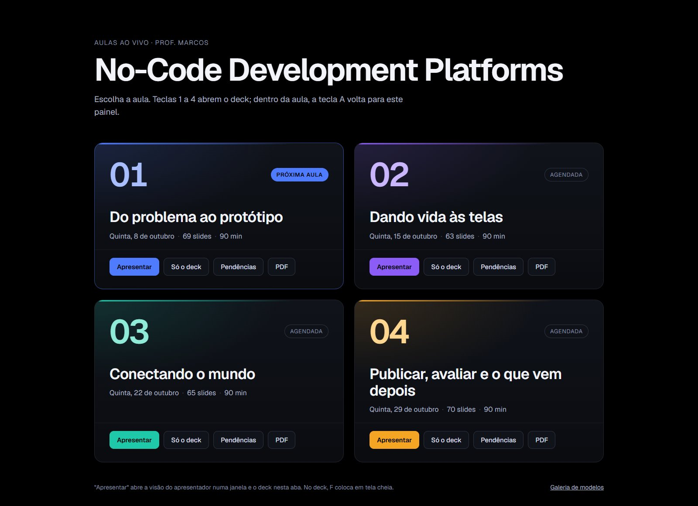
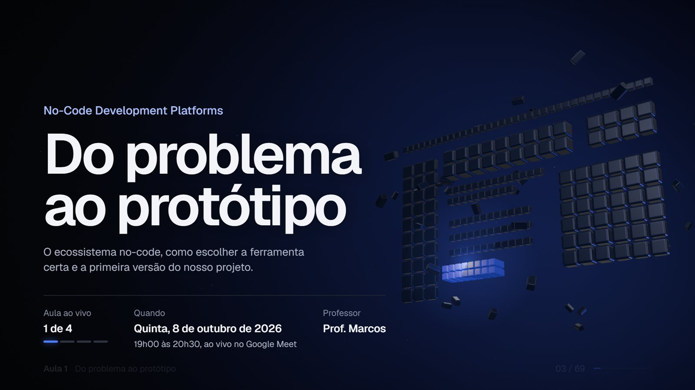
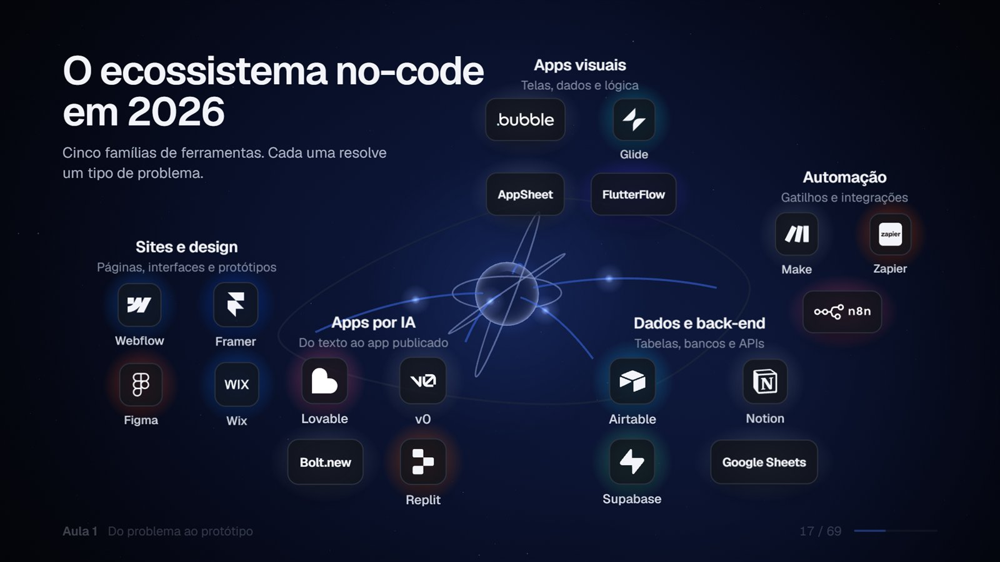
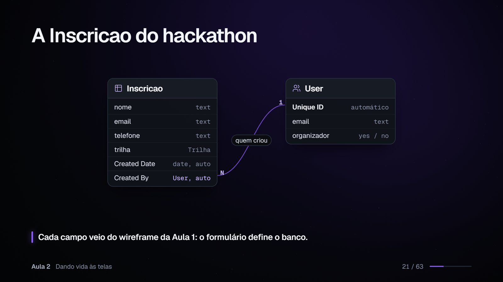
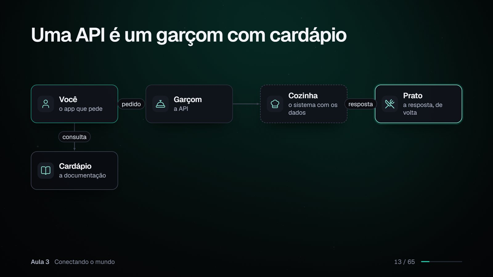
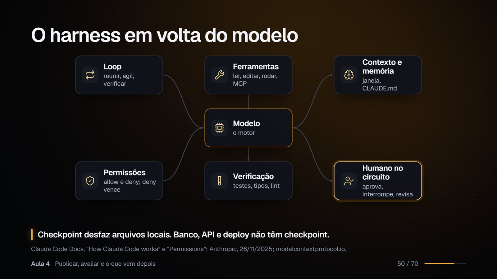

# Aulas ao vivo: No-Code Development Platforms

Apresentação web das quatro aulas ao vivo da disciplina **No-Code Development Platforms**, feita para ser projetada no Google Meet e gravada. São 267 slides em 1920 × 1080, com cenas 3D, animações e modo apresentador. Roda offline e funciona com ou sem alunos na sala.



## As quatro aulas

| Aula | Data | Tema | Slides |
|---|---|---|---|
| 1 | 08/10/2026 | **Do problema ao protótipo:** ecossistema no-code, MVP, UX, wireframe e uma página gerada por IA | 69 |
| 2 | 15/10/2026 | **Dando vida às telas:** banco de dados, workflows e privacidade no Bubble | 63 |
| 3 | 22/10/2026 | **Conectando o mundo:** APIs, webhooks, automação com Make e app a partir de planilha | 65 |
| 4 | 29/10/2026 | **Publicar, avaliar e o que vem depois:** publicação, segurança, custos, IA, agentes e harness | 70 |

Todas seguem o mesmo projeto fictício, o *Hackathon No-Code 2026*, que evolui de aula em aula: planejamento, página de inscrição, banco e regras, automação, app de check-in e avaliação crítica.

## Prévia

| | |
|---|---|
|  |  |
| Capa com cena 3D (Aula 1) | Mapa do ecossistema com logos oficiais (Aula 1) |
|  |  |
| Modelo de dados da inscrição (Aula 2) | API explicada com um diagrama de fluxo (Aula 3) |
|  | |
| O harness de um agente de IA (Aula 4) | |

## Recursos

- **Painel principal** para escolher a aula com um clique ou pelas teclas 1 a 4.
- **Modo apresentador** numa segunda janela: slide atual e próximo, notas, cronômetro e relógio, sincronizados com o deck.
- **Pausas para pensar** com contagem e resposta revelada sozinha: a aula funciona mesmo sem ninguém participando.
- **Vídeos de backup** para cada demonstração ao vivo (tecla V), caso a ferramenta falhe.
- **Exportação para PDF** de todos os slides.
- **Modo pendências**, que destaca as capturas e os vídeos que ainda faltam produzir.
- **25 modelos de slide** (capa, estatística, comparação, fluxo, modelo de dados, código, linha do tempo, estudo de caso e outros) e **15 cenas 3D** de fundo.
- Tudo embutido no build: fontes, ícones, logos e bibliotecas. Nada depende de internet durante a aula.

## Rodar localmente

Requisito: Node.js 22 ou mais recente.

```bash
npm install          # uma vez
npm run dev          # desenvolvimento: http://localhost:5180
npm run build        # checagem de tipos + build estático em dist/
npm run preview      # serve dist/ em http://localhost:5181 (use este na aula)
```

Abra o endereço sem parâmetros para ver o painel. Em "Apresentar", o deck abre nesta aba e o modo apresentador numa janela nova; depois aperte F para tela cheia. No Google Meet, compartilhe só a janela do deck.

## Subir numa VPS com Docker

Requisito: Docker com o plugin Compose. Na VPS:

```bash
git clone https://github.com/mfelipedias/aulas-nocode.git
cd aulas-nocode
docker compose up -d
```

As aulas ficam em `http://<ip-da-vps>:8080`. Para usar outra porta, crie um `.env` a partir do `.env.example` e mude `PORTA`.

- **Capturas e vídeos:** copie para `public/media/aula-0N/` dentro da pasta clonada (por exemplo com `scp`). A pasta é montada no container, então os arquivos aparecem na hora, sem rebuild.
- **Atualizar:** `git pull && docker compose up -d --build`.
- **Parar:** `docker compose down`.
- **HTTPS com domínio:** aponte o proxy reverso que já roda na VPS (Nginx, Caddy ou Traefik) para `http://127.0.0.1:8080`.

## Endereços

| URL | O que abre |
|---|---|
| `index.html` | Painel principal com as quatro aulas |
| `index.html?aula=01` ... `?aula=04` | Deck de cada aula |
| `presenter.html?aula=0N` | Modo apresentador (ou tecla P no deck) |
| `index.html?aula=0N&rascunho=1` | Destaca em âmbar as mídias que ainda faltam |
| `index.html?aula=0N&print=1` | Todos os slides para salvar em PDF (Ctrl+P, sem margens, com gráficos de fundo) |
| `index.html?aula=0N#/12/3` | Link direto para o slide 12, passo 3 |
| `index.html?aula=galeria` | Galeria com todos os modelos de slide |

## Teclas

| Tecla | Ação |
|---|---|
| Seta direita, espaço, Page Down | Avança |
| Seta esquerda, Page Up | Volta |
| Número + Enter | Vai para o slide |
| O ou Esc | Visão geral |
| P | Modo apresentador |
| A | Volta ao painel das aulas |
| F | Tela cheia |
| B ou ponto | Tela preta |
| V | Vídeo de backup da demonstração |
| T | Pausa a contagem e o cronômetro do slide |
| M | Movimento reduzido |
| H | Ajuda |

Mexer o mouse mostra, por 2 segundos, um botão discreto de volta ao painel no canto superior esquerdo.

## Estrutura

```
src/
├── decks/aula-0N/      conteúdo de cada aula: slides e notas do apresentador
├── archetypes/         os modelos de slide
├── three/              as cenas 3D
├── engine/             navegação, passos, sincronização com o apresentador
├── hub.ts              painel principal
└── assets/logos/       logos oficiais e suas fontes
public/media/aula-0N/   capturas e vídeos de backup
docker/                 configuração do nginx
```

Novas aulas são encontradas automaticamente: basta criar `src/decks/aula-05/index.ts`.

## Tecnologia

[Vite](https://vite.dev), TypeScript, [Three.js](https://threejs.org), [GSAP](https://gsap.com), [Lucide](https://lucide.dev) (ícones), [simple-icons](https://simpleicons.org) e as fontes Geist e Instrument Serif. Em produção, um nginx serve o build estático.

## Marcas e logotipos

Os logotipos em `src/assets/logos/oficiais/` foram obtidos nas páginas oficiais de marca de cada empresa e são usados aqui apenas de forma editorial e educacional. Eles pertencem às respectivas empresas e não estão cobertos por nenhuma licença deste repositório. Origem, data e regras de uso de cada arquivo: [`src/assets/logos/FONTES.md`](src/assets/logos/FONTES.md). Os demais ícones de marca vêm do pacote [simple-icons](https://simpleicons.org) (CC0 para os dados; as marcas continuam pertencendo aos donos).
